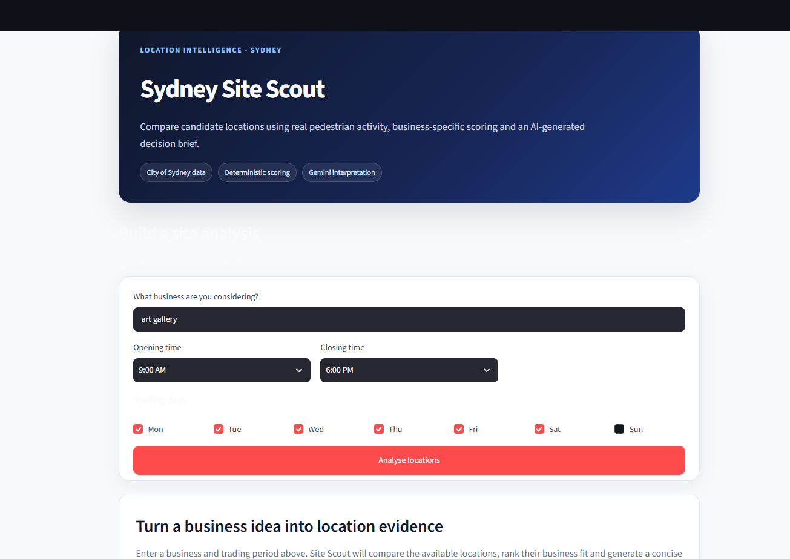
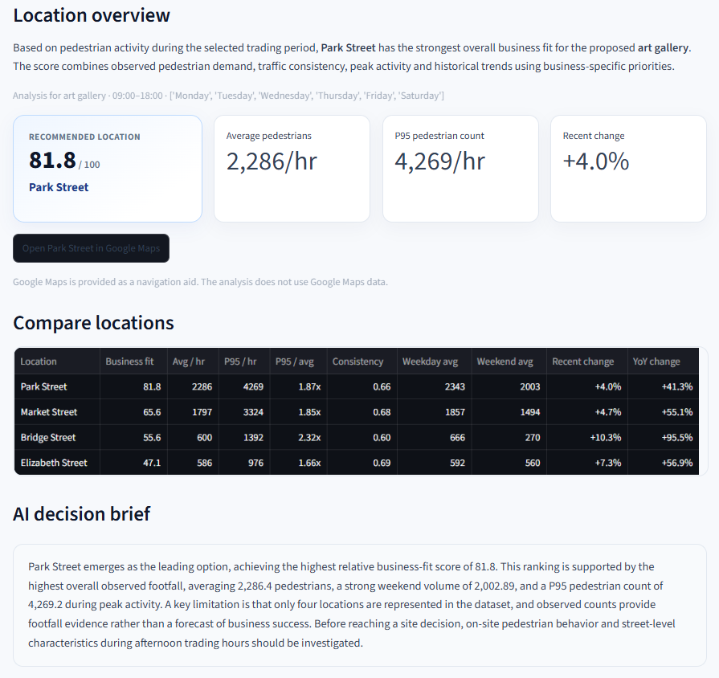

# Sydney Site Scout

Sydney Site Scout is a location analysis tool that compares potential business locations using real pedestrian activity data from the City of Sydney.

## Overview

The idea behind the project is simple: a good location depends on the type of business and when it expects customers to be around.

A user enters a business type and selects their expected trading hours and days. The application analyses pedestrian activity during those periods and compares the available locations, while Gemini interprets the results in the context of the proposed business.

The application uses:

- Python and pandas to process the pedestrian data and calculate location metrics.
- Python to calculate reproducible location scores from the pedestrian metrics.
- LangGraph to manage the analysis workflow and data-quality checks.
- Gemini to interpret the calculated evidence for the proposed business.
- Gemini to turn the final results into a short decision brief.
- Streamlit to provide the user interface.

## Demo

The user enters the type of business they are considering and selects the days and hours they expect it to operate.

### Business Input



### Location Analysis

The application compares the available locations and returns the strongest match, its business-fit score, the underlying pedestrian metrics and a short AI-generated explanation.



The underlying metrics and scores are calculated reproducibly in Python. Gemini uses the proposed business as context when interpreting and explaining the results.

## Data

The project uses City of Sydney pedestrian count data with **188,720 observations** across four locations:

- Park Street
- Market Street
- Bridge Street
- Elizabeth Street

The data is filtered to the trading hours and days selected by the user.

For each location, the application looks at:

- **Average Pedestrian Activity** — typical pedestrian volume during the selected period
- **P95 Pedestrian Activity** — a measure of high foot traffic without relying on extreme maximum values
- **Traffic Consistency** — how stable pedestrian activity is over time
- **Weekday / Weekend Activity** — differences in traffic depending on the selected trading days
- **Recent Change** — whether pedestrian activity has recently increased or decreased
- **Year-on-Year Change** — how activity compares with the corresponding historical period

## Scoring

Python calculates relative 0–100 scores for pedestrian demand, consistency, peak activity and historical trends using the available location data.

These metrics are combined using a consistent scoring approach to produce a **0–100 business-fit score** and rank the four locations. Because the numerical analysis is deterministic, identical inputs and data produce identical scores.

Gemini does not calculate the scores. It receives the calculated evidence alongside the proposed business and uses that context to interpret the results and generate the final recommendation.

## Workflow

```text
Business input
      ↓
Pedestrian data analysis
      ↓
Data quality check
      ↓
Location scoring
      ↓
Risk analysis
      ↓
AI interpretation
      ↓
AI decision brief
      ↓
Streamlit
```

## Key considerations

- **Foot traffic does not guarantee customers.** A production version could combine pedestrian activity with demographic, transaction and mobility data to better understand actual demand.
- **The scores compare locations rather than predict success.** The scoring uses consistent rules and equal weighting so results are transparent and reproducible. With historical business performance data, these assumptions could be tested and improved.
- **Some thresholds are predefined.** Simple rules are used to flag things such as unusually volatile traffic, declining activity or limited data. These provide useful warnings but could be refined with more data.
- **Commercial factors are not currently included.** Rent, competition, demographics and zoning could significantly affect a real site decision and could be added through other datasets or APIs.
- **Gemini interprets the evidence rather than calculating it.** The numerical analysis is handled in Python, while Gemini uses the business type and calculated results to provide a recommendation and explanation.

## Running locally

Install the project dependencies, add a Gemini API key to `.env`, then run:

```bash
streamlit run app.py
```

## Stack

Python · pandas · NumPy · LangChain · LangGraph · Google Gemini · Streamlit · Git

## Development approach

This project was developed as an AI-assisted learning project to strengthen my practical understanding of LangChain, LangGraph and LLM-based application development. AI tools supported implementation, troubleshooting and iteration while I worked through the workflow design, deterministic data analysis, scoring, Gemini integration and application behaviour.